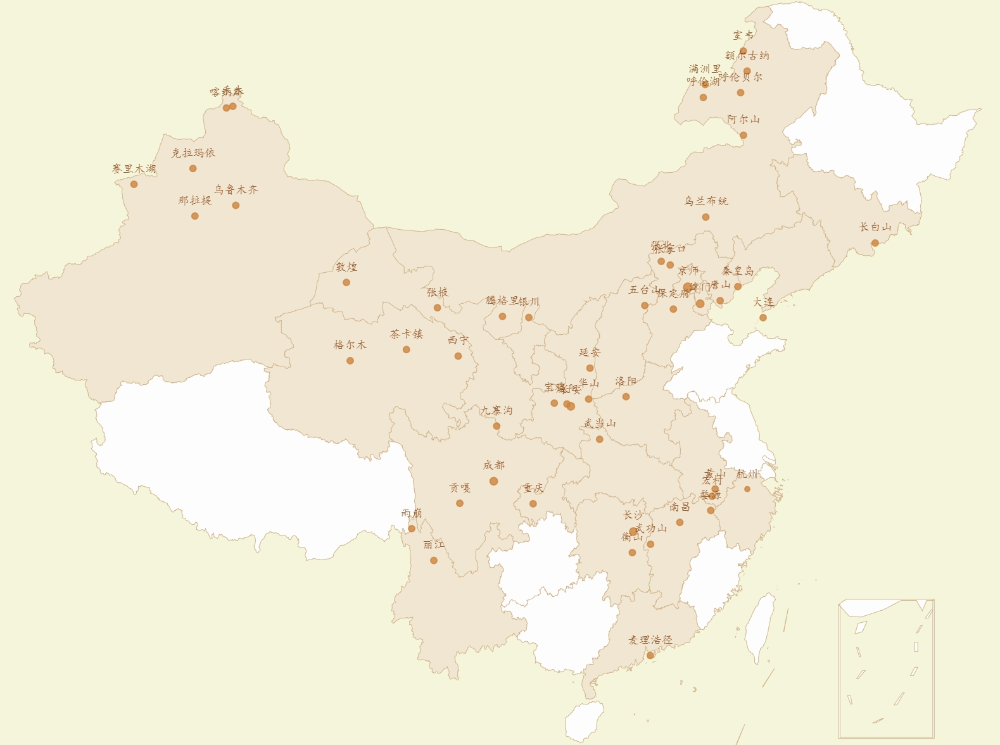
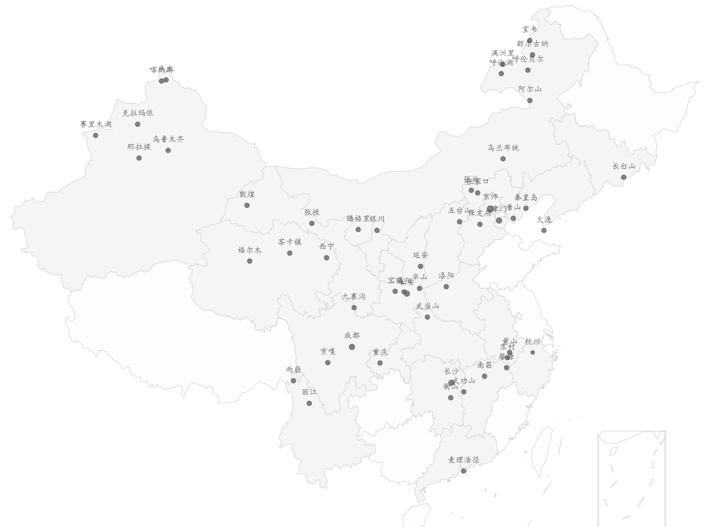

| 样式 | `blackStyle`    | `grayStyle`     |
| ---- | --------------- | --------------- |
| 效果 |  |  |

# 简介

- 24 年偶然发现「高德地图」可以点亮走过的城市。但是无法点亮 18，19 年去过的城市，因为那会儿我并非「高德地图」的用户。
- 市面上常见的足迹、点亮城市等 APP 需要打卡。这让我这种简约旅行者觉得很讨厌。其他小程序也不尽人意。
- 忽然发现了我是程序员，可以自己动手写一个。打开 `Echarts`，简化网上搜来的代码，遂有了本仓库。代码开箱即用，足够简洁。

# 使用

我把接口设置的异常简单。

## 样式切换

自己定义 `RGB` 并切换即可。

```js
let blackStyle = [
   "#343233",  // 背景和省份颜色
   "#2be4f3",  // 省份边界线颜色
   "#5aae5c",  // 点亮省份的颜色
   "#fff",     // 标签字体的颜色
   "#ffff00"   // 城市圆点的颜色
];
let grayStyle = [
   "#dedfde",
   "#6e6e6d",
   "#d5e5f1",
   "#000",
   "#fe7e3a",
]

// 自由选择样式
let style = grayStyle;
```

## 点亮省份

在 `regions` 添加字段即可。

```js
regions: [
   { name: ["河北省"], itemStyle: { normal: { areaColor: "#5aae5c" }, }, },
   { name: ["湖北省"], itemStyle: { normal: { areaColor: "#5aae5c" }, }, },
   { name: ["吉林省"], itemStyle: { normal: { areaColor: "#5aae5c" }, }, },
   { name: ["北京市"], itemStyle: { normal: { areaColor: "#5aae5c" }, }, },
   { name: ["天津市"], itemStyle: { normal: { areaColor: "#5aae5c" }, }, },
   { name: ["内蒙古自治区"], itemStyle: { normal: { areaColor: "#5aae5c" }, }, },
   { name: ["陕西省"], itemStyle: { normal: { areaColor: "#5aae5c" }, }, },
   { name: ["湖南省"], itemStyle: { normal: { areaColor: "#5aae5c" }, }, },
   { name: ["江西省"], itemStyle: { normal: { areaColor: "#5aae5c" }, }, },
   { name: ["安徽省"], itemStyle: { normal: { areaColor: "#5aae5c" }, }, },
   { name: ["青海省"], itemStyle: { normal: { areaColor: "#5aae5c" }, }, },
   { name: ["四川省"], itemStyle: { normal: { areaColor: "#5aae5c" }, }, },
   { name: ["河南省"], itemStyle: { normal: { areaColor: "#5aae5c" }, }, },
   { name: ["甘肃省"], itemStyle: { normal: { areaColor: "#5aae5c" }, }, },
   { name: ["河北省"], itemStyle: { normal: { areaColor: "#5aae5c" }, }, },
],
```

## 去过的城市

添加经纬度即可。

```js
 data: [
   { name: '北京', value: [116.407387, 39.904179] },
   { name: '长白山', value: [128.333, 42.026] },
   { name: '武当山', value: [110.785239, 32.647017] },
   { name: '保定', value: [115.482331, 38.867657] },
   { name: '唐山', value: [118.460379, 39.273070] },
   { name: '天津', value: [117.190182, 39.125596] },
   { name: '秦皇岛', value: [119.586579, 39.942531] },
   { name: '乌兰布统', value: [117.54562, 43.26501] },
   { name: '张家口', value: [115.27993, 40.97519] },
   { name: '成都', value: [104.04303, 30.64235] },
   { name: '西宁', value: [101.778916, 36.623178] },
   { name: '长沙', value: [112.93133, 28.2351] },
   { name: '南昌', value: [115.892151, 28.676493] },
   { name: '武功山', value: [114.02951, 27.63063] },
   { name: '黄山', value: [118.1416, 30.2729] },
   { name: '洛阳', value: [112.46902, 34.68364] },
   { name: '敦煌', value: [94.66159, 40.14211] },
   // { name: '黟县', value: [117.94137, 29.92588] },
   { name: '西安\n 咸阳', value: [108.94866, 34.22245] },
   { name: '华山', value: [110.08752, 34.56608] },
   { name: '延安', value: [110.17196, 36.04732] },
   { name: '宝鸡', value: [107.90017, 34.37524] },
   // { name: '咸阳', value: [108.705117, 34.333439] },
   { name: '九寨沟县', value: [104.231374, 33.279792] },
   { name: '茶卡镇', value: [98.48196, 36.93471] },
   { name: '张掖', value: [100.455472, 38.932897] },
   { name: '格尔木', value: [94.90329, 36.40236] },
   { name: '衡山', value: [112.86776, 27.23134] },
],
```

> 有了很多遗憾后才明白我只能活一次，青春也只有一次。祝各位旅游快乐，多看世界，早日点亮全中国。
>
> 14 岁那年的地理课上，一个少年被深深吸引，想看遍全世界。
>
> 18 岁学业繁忙；22 岁囊中羞涩。
>
> 现在终于有能力看这个世界，给我一个周六日，我能横扫各大山头。陪我前来的，还有一个阔别 12 年的朋友。
>
> 看到了广袤天地，看到了芸芸众生，也看到了曾经的自己。潇湘夜雨，大漠西北，山野间追风，看黎明和黄昏。
>
> 每次徒步都是这样。搭子是路上捡的，天是随缘聊的，听者动感音乐在山野散步聊天，迎面出来自由的风，快乐在此刻达到了顶峰。
>
> 火车站吃饭告别，聚少离多，浅浅感受，深深怀念，缘分参差错落，浪漫至死不渝，有缘山里还会再见。。
